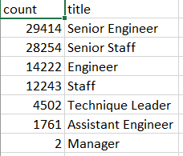

# Pewlett-Hackard-Analysis
## Overview
The purpose of this analysis is to create two tables to determine the number of retiring employees per titles and identify employees who are eligible to participate in a mentorship program. 
## Results
The first table shows the number of retiring employees and the position titles. 

This second table shows who's eligible for the mentorship program as well as their title. From these tables there are four points that can be seen:

* The majority of those retiring hold Senior titles, with Senior Engineers making up the majority and Senior Staff following. 
* Being that Senior Engineers and Senior Staff have the highest retiring titles, those titles will be the most important to fill when hiring is being considered. 
* The mentorship eligibilty program has less mentors than those retiring.

## Summary
In order to determine how many roles will need to be filled as the "silver tsunami" begins it would be good to make a table to determine how many retirees there will be annually according to the age group. By doing so, it will let you know how many positions will need to be filled according to how many retirees there will be in each year.

It does not seem as though there are enough retirement ready employees to mentor the next generation. It would probably be a good idea to group how many retirees there will be by position title to determine how many will be available to train the next generation in that position. 

